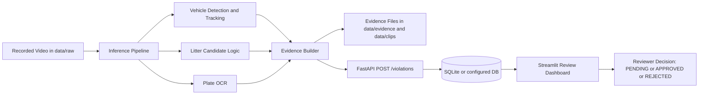

# Vehicle Littering AI MVP

This repository is a working prototype for detecting possible littering events from moving vehicles.

It does four things end-to-end:
- Detects and tracks vehicles in recorded traffic video.
- Uses a litter-event heuristic (motion + proximity + outward movement) to flag candidates.
- Attempts number plate OCR for the tracked vehicle.
- Saves evidence and sends events to a review API/dashboard.

## What This Project Is (And Is Not)

This project is:
- A candidate-detection system for human review.
- Useful for pilots, demos, and iteration with real footage.

This project is not:
- An automatic fine issuing system.
- A complete legal enforcement product.
- A final model for every weather, camera angle, or geography.

## Current Scope

In scope:
- Vehicle detection and tracking.
- Candidate littering detection.
- Plate text extraction (best effort).
- Evidence generation (frame + clip + metadata).
- Review workflow with status updates (`PENDING`, `APPROVED`, `REJECTED`).

Out of scope for this MVP:
- Rash driving and noise enforcement.
- Fully automated penalties.
- Multi-camera identity tracking across junctions.

## Repository Layout

- `services/inference` - offline video pipeline and litter logic.
- `services/api` - FastAPI app, database models, review endpoints.
- `dashboard` - Streamlit review interface.
- `scripts` - setup, run helpers, demo video generator, stress tester.
- `data/raw` - input videos.
- `data/evidence` - saved evidence images and metadata JSON.
- `data/clips` - saved short event clips.

## Architecture Diagram



## Prerequisites

- Windows PowerShell.
- Python 3.14+.
- Internet on first run (model files are downloaded once).

## Quick Start (5-10 minutes)

1. Create environment and install dependencies.

```powershell
python -m venv .venv
.\.venv\Scripts\Activate.ps1
pip install -r requirements.txt
```

2. Start the API.

```powershell
uvicorn services.api.main:app --host 127.0.0.1 --port 8000
```

3. Start the dashboard in a second terminal.

```powershell
streamlit run dashboard/app.py --server.port 8501
```

4. Add a video to `data/raw` and run pipeline.

```powershell
python -m services.inference.run_offline --video data/raw/traffic.mp4 --api-url http://127.0.0.1:8000 --camera-id cam-01
```

5. Open dashboard: `http://127.0.0.1:8501`

## Fast Start With Helper Scripts

From project root:

```powershell
.\scripts\bootstrap.ps1
.\scripts\run_api.ps1
.\scripts\run_dashboard.ps1
.\scripts\run_pipeline.ps1 -Video data/raw/traffic.mp4
```

If you do not have a sample video yet:

```powershell
python scripts/generate_demo_video.py
```

Note: the generated demo clip is synthetic and may produce zero violations. Use real traffic footage for meaningful detection output.

## Data Flow

Pipeline flow:
- Read frame from video.
- Track vehicles (YOLO + ByteTrack path in Ultralytics).
- Detect litter candidates from motion/object cues.
- Attempt plate OCR on the vehicle crop.
- Build evidence bundle.
- POST event to API.
- Review in dashboard and update status.

## Evidence Output

For each emitted event:
- `data/evidence/<event_id>.jpg` (representative evidence frame)
- `data/evidence/<event_id>.json` (metadata, confidence, source references)
- `data/clips/<event_id>.mp4` (short contextual clip)

## API Endpoints

- `GET /health` - service health check.
- `POST /violations` - create candidate violation.
- `GET /violations?status=PENDING&limit=100` - list events.
- `PATCH /violations/{event_id}/status` - set review status and note.

## Load and Stress Testing

Run standard pressure test:

```powershell
python scripts/stress_test_api.py --base-url http://127.0.0.1:8000 --requests 1000 --concurrency 50 --timeout 8
```

Run extreme pressure test:

```powershell
python scripts/stress_test_api.py --base-url http://127.0.0.1:8000 --requests 3000 --concurrency 120 --timeout 8
```

PowerShell wrapper:

```powershell
.\scripts\run_stress.ps1 -Requests 1000 -Concurrency 50
```

## Configuration

Environment variables:
- `LITTER_DB_URL` default: `sqlite:///./litter_events.db`
- `EVIDENCE_DIR` default: `data/evidence`
- `CLIPS_DIR` default: `data/clips`
- `VEHICLE_MODEL` default: `yolov8n.pt`
- `LITTER_MODEL` default: empty (motion-only fallback)
- `FRAME_SKIP` default: `2`

## Known Limitations

- Litter detection is heuristic-first and can miss subtle events.
- OCR quality depends heavily on plate visibility, angle, and lighting.
- SQLite is good for MVP, not ideal for long-term high write throughput.
- No legal workflow, appeals, or jurisdiction logic is implemented.

## Recommended Next Improvements

- Replace heuristic-only litter logic with a trained litter-action model.
- Move from SQLite to PostgreSQL for production-grade concurrency.
- Add camera calibration for better motion interpretation.
- Add dataset management and evaluation metrics pipeline.

## Safety and Enforcement Note

Treat all detections as candidate alerts.

Human verification is mandatory before any enforcement action.
